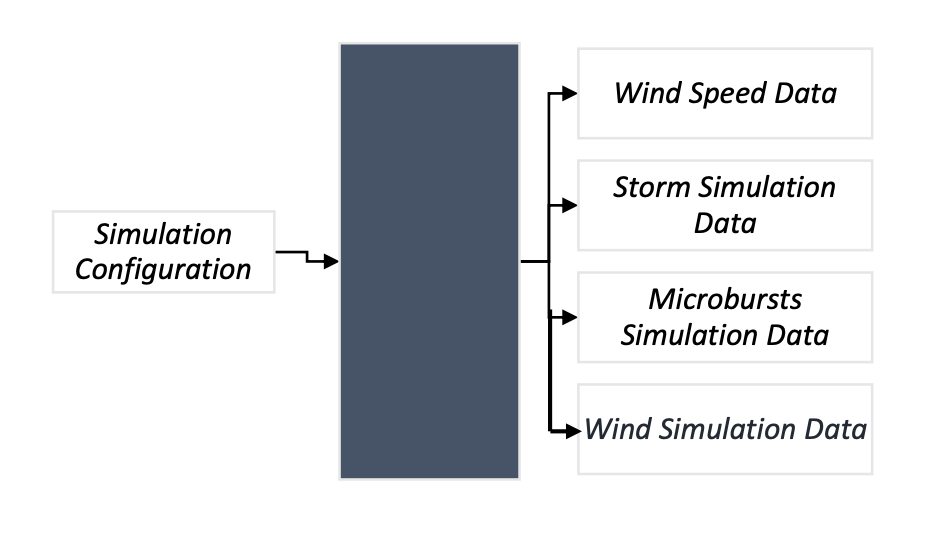

**Problem Identification and Statement** 

*The objective is to develop a software that can generate a computer simulation of wind speed for a flight simulator. The final wind simulation is generated by modelling wind speed and incorporating storm simulation and microbursts simulation to it.* 

**Gathering  of  Information  and  Input/Output Description**

**Relevant information:**  

*The wind speed for a particular region can be modelled by using an average value and a gust value that is added to the average. For example, the wind speed might be 10 miles per hour, with added noise (which represents gusts) of 5 miles per hour, the wind speed would be a value between 5 and 15 (10 ±5). Starting from time at 0 seconds up to the entire simulation duration, at every interval the software generates a corresponding random number between the (average value – gust value) and the (average value + gust value), in accordance with the simulation configuration.*   

*Assuming that the possibility of encountering a storm at each time step is Pstorm, the software adds a storm magnitude (a random number between the minimum and maximum storm amplitude values) to the simulated wind speed for a duration T (a random number between the minimum and maximum storm duration). All required values are taken from the simulation configuration.* 

*The storm simulation also includes a simulation of microbursts. Microburst are simulated using three parameters: the possibility of encountering a microburst at each time step in a storm (Pburs), the burst amplitude (a random number between the minimum and maximum microburst amplitude values), and the duration of the burst (a random number between the minimum and maximum storm duration values). All required values are taken from the simulation configuration.* 

**Input/Output Description:**  

*The inputs are: Simulation Configuration (“simulationConfiguration.txt") The outputs are:*  

1. *Wind Speed Data ("WindSpeedData.txt")* 
1. *Storm Simulation Data ("StormData.txt")* 
1. *Microbursts Simulation Data ("BurstData.txt")* 
1. *Wind Simulation Data ("WindSpeedData.txt")* 

*The Simulation Configuration file will include the following inputs required for the simulation:*  

1. Wind simulation configurations: *the average speed, gust value, duration, and step size* 
1. Storm simulation parameters: *the storm probability, the minimum and maximum storm amplitude, and the minimum and maximum storm duration values* 
1. Microburst parameters: *the microburst probability, the minimum and maximum burst amplitude, and the minimum and maximum microburst duration values* 

*The software assumes that all input values in the simulation configuration are valid values and fall within the scope of the problem.* 

*Output 4, the Wind Simulation Data is a combination of output 1, output 2 and output 3. All outputs will be in the format of text files, with the first column being the time and the second column the corresponding magnitude at that time. In the Wind Simulation Data text file, all active storm instances will have an additional third column of ‘1’ signifying the presence of the storm.*

**Black-box Diagram:**

Alternatively, the inputs and outputs could be represented using a black-box diagram: *Wind Speed Data *

*Storm Simulation Simulation Data* 

*Configuration*

*Microbursts Simulation Data* 

*Wind Simulation Data* 

**Test Cases and Expected Outcomes (Hand-solved Problems):** 

**Test cases:**  

**Test case 1:** 

<table><tr><th colspan="1" rowspan="4"><b>Input</b> </th><th colspan="1">Average Wind Speed </th><th colspan="1">Gust Value </th><th colspan="1">Simulation Duration </th><th colspan="1">Step Size </th><th colspan="1">Storm Probability </th><th colspan="1">Minimum Storm Amplitude </th><th colspan="1">Maximum Storm Amplitude </th></tr>
<tr><td colspan="1">10 </td><td colspan="1">5 </td><td colspan="1">3600 </td><td colspan="1">100 </td><td colspan="1">0\.05 </td><td colspan="1">10 </td><td colspan="1">20 </td></tr>
<tr><td colspan="1">Minimum Storm Duration Value </td><td colspan="1">Maximum Storm Duration Value </td><td colspan="1">Microburst Probability </td><td colspan="1">Minimum Burst Amplitude </td><td colspan="1">Maximum Burst Amplitude </td><td colspan="1">Minimum Burst Duration Value </td><td colspan="1">Maximum Burst Duration Value </td></tr>
<tr><td colspan="1">80 </td><td colspan="1">110 </td><td colspan="1">0\.02 </td><td colspan="1">35 </td><td colspan="1">46 </td><td colspan="1">50 </td><td colspan="1">75 </td></tr>
</table>

**Expected Outcome:**  

Text files generated: WindSpeedData.txt, StormData.txt, BurstData.txt, WindSimulation.txt All text files will have 2 columns: time and the corresponding magnitude.  

Time column will start at 0 and have an increment of 100 seconds at each step till it reaches 3600. Hence, there will be 36 rows (data point coordinates) in total.  

All magnitudes generated by the software in WindSpeedData.txt will be between 5.0 and 15.0. 

In the case that a storm occurs (probability of 5%), the corresponding magnitude in StormData.txt will be between 10.0 and 20.0 and this will occur for a minimum of 80 seconds (1 step/row) and for a maximum of 110 seconds (2 steps/row). All other rows will have a magnitude of 0.0. Since the probability is low, most storm magnitudes will be 0.0. 

A burst shall only occur in the case of a storm, and even then its probability is only 2%. The magnitude in BurstData.txt will be between 35.0 and 46.0 for a minimum of 50 seconds (1 step/row) and a maximum of 75 seconds (1 step/row).  

The final WindSimulation.txt file will combine the corresponding magnitudes at each time step of all the other files. The WindSimulation.txt will have a third column displaying ‘1’ in case a storm occurs in that particular time step.  

**Test case 2:** 

<table><tr><th colspan="1" rowspan="4"><b>Input</b> </th><th colspan="1">Average Wind Speed </th><th colspan="1">Gust Value </th><th colspan="1">Simulation Duration </th><th colspan="1">Step Size </th><th colspan="1">Storm Probability </th><th colspan="1">Minimum Storm Amplitude </th><th colspan="1">Maximum Storm Amplitude </th></tr>
<tr><td colspan="1">100 </td><td colspan="1">12 </td><td colspan="1">600 </td><td colspan="1">20 </td><td colspan="1">0\.1 </td><td colspan="1">50 </td><td colspan="1">70 </td></tr>
<tr><td colspan="1">Minimum Storm Duration Value </td><td colspan="1">Maximum Storm Duration Value </td><td colspan="1">Microburst Probability </td><td colspan="1">Minimum Burst Amplitude </td><td colspan="1">Maximum Burst Amplitude </td><td colspan="1">Minimum Burst Duration Value </td><td colspan="1">Maximum Burst Duration Value </td></tr>
<tr><td colspan="1">12 </td><td colspan="1">28 </td><td colspan="1">0\.76 </td><td colspan="1">84 </td><td colspan="1">98 </td><td colspan="1">9 </td><td colspan="1">18 </td></tr>
</table>

**Expected Outcome:**  

Text files generated: WindSpeedData.txt, StormData.txt, BurstData.txt, WindSimulation.txt All text files will have 2 columns: time and the corresponding magnitude.  

Time column will start at 0 and have an increment of 20 seconds at each step till it reaches 600. Hence, there will be 30 rows (and data-points) in total.  

All magnitudes generated by the software in WindSpeedData.txt will be between 88.0 and 112.0. 

In the case that a storm occurs (10% probability, low), the magnitude in StormData.txt will be between 50.0 and 70.0 and this will occur for a minimum of 12 seconds (1 step/row) and for a maximum of 28 seconds (2 steps/row). All other rows will have a magnitude of 0.0. 

A burst shall only occur in the case of a storm. However, the probability of a burst occurrence is 76% (very high) and thus, most storm cases will have corresponding burst occurrence too. Thus, we can expect most storm cases to have corresponding burst occurrences. The magnitude in BurstData.txt will be between 84.0 and 98.0 for a minimum of 9 seconds (1 step/row) and a maximum of 18 seconds (1 step/row).  

The final WindSimulation.txt file will combine the corresponding magnitudes at each time step of all the other files. The WindSimulation.txt will have a third column displaying ‘1’ in case a storm occurs in that particular time step.  

**Test case 3:** 
<table><tr><th colspan="1" rowspan="4"><b>Input</b> </th><th colspan="1">Average Wind Speed </th><th colspan="1">Gust Value </th><th colspan="1">Simulation Duration </th><th colspan="1">Step Size </th><th colspan="1">Storm Probability </th><th colspan="1">Minimum Storm Amplitude </th><th colspan="1">Maximum Storm Amplitude </th></tr>
<tr><td colspan="1">567 </td><td colspan="1">67 </td><td colspan="1">145 </td><td colspan="1">5 </td><td colspan="1">0\.5 </td><td colspan="1">150 </td><td colspan="1">205 </td></tr>
<tr><td colspan="1">Minimum Storm Duration Value </td><td colspan="1">Maximum Storm Duration Value </td><td colspan="1">Microburst Probability </td><td colspan="1">Minimum Burst Amplitude </td><td colspan="1">Maximum Burst Amplitude </td><td colspan="1">Minimum Burst Duration Value </td><td colspan="1">Maximum Burst Duration Value </td></tr>
<tr><td colspan="1">2 </td><td colspan="1">12 </td><td colspan="1">0\.08 </td><td colspan="1">300 </td><td colspan="1">400 </td><td colspan="1">3 </td><td colspan="1">8 </td></tr>
</table>

**Expected Outcome:**  

Text files generated: WindSpeedData.txt, StormData.txt, BurstData.txt, WindSimulation.txt All text files will have 2 columns: time and the corresponding magnitude.  

Time column will start at 0 and have an increment of 5 seconds at each step till it reaches 145. Hence, there will be 29 rows (and data-points) in total.  

All magnitudes generated by the software in WindSpeedData.txt will be between 500.0 and 634.0. 

In the case that a storm occurs (50% probability), the magnitude in StormData.txt will be between 150.0 and 205.0 and this will occur for a minimum of 2 seconds (1 step/row) and for a maximum of 12 seconds (3 steps/row). In this test case, the probability of a storm occurrence is very high, hence most storm magnitudes will be non-zero values. All other rows will have a magnitude of 0.0. 

A burst shall only occur in the case of a storm. However, the probability of a burst occurrence is 8% (low) and thus, not many storm cases will have corresponding burst occurrence. The magnitude in BurstData.txt will be between 300.0 and 400.0 for a minimum of 3 seconds (1 step/row) and a maximum of 8 seconds (2 steps/row).  

The final WindSimulation.txt file will combine the corresponding magnitudes at each time step of all the other files. The WindSimulation.txt will have a third column displaying ‘1’ in case a storm occurs in that particular time step.  

**Test case 4:** 
<table><tr><th colspan="1" rowspan="4"><b>Input</b> </th><th colspan="1">Average Wind Speed </th><th colspan="1">Gust Value </th><th colspan="1">Simulation Duration </th><th colspan="1">Step Size </th><th colspan="1">Storm Probability </th><th colspan="1">Minimum Storm Amplitude </th><th colspan="1">Maximum Storm Amplitude </th></tr>
<tr><td colspan="1">40 </td><td colspan="1">3 </td><td colspan="1">800 </td><td colspan="1">32 </td><td colspan="1">0\.09 </td><td colspan="1">100 </td><td colspan="1">120 </td></tr>
<tr><td colspan="1">Minimum Storm Duration Value </td><td colspan="1">Maximum Storm Duration Value </td><td colspan="1">Microburst Probability </td><td colspan="1">Minimum Burst Amplitude </td><td colspan="1">Maximum Burst Amplitude </td><td colspan="1">Minimum Burst Duration Value </td><td colspan="1">Maximum Burst Duration Value </td></tr>
<tr><td colspan="1">10 </td><td colspan="1">30 </td><td colspan="1">0\.23 </td><td colspan="1">200 </td><td colspan="1">250 </td><td colspan="1">1 </td><td colspan="1">14 </td></tr>
</table>

**Expected Outcome:**  

Text files generated: WindSpeedData.txt, StormData.txt, BurstData.txt, WindSimulation.txt All text files will have 2 columns: time and the corresponding magnitude.  

Time column will start at 0 and have an increment of 32 seconds at each step till it reaches 800. Hence, there will be 25 rows (and data-points) in total.  

All magnitudes generated by the software in WindSpeedData.txt will be between 37.0 and 43.0. 

In the case that a storm occurs (9% probability), the magnitude in StormData.txt will be between 100.0 and 120.0 and this will occur for a minimum of 10 seconds (1 step/row) and for a maximum of 30 seconds (1 step/row). In this test case, the probability of a storm occurrence is low, hence most storm magnitudes will be zero values.  

A burst shall only occur in the case of a storm. However, the probability of a burst occurrence is 23% (moderate) and thus, some storm cases will have corresponding burst occurrence. The magnitude in BurstData.txt will be between 200.0 and 250.0 for a minimum of 1 seconds (1 step/row) and a maximum of 14 seconds (1 step/row).  

The final WindSimulation.txt file will combine the corresponding magnitudes at each time step of all the other files. The WindSimulation.txt will have a third column displaying ‘1’ in case a storm occurs in that particular time step.  

**Step 5: Software testing and Verification** 

**Test Case 1:**

**Test Case 2:** 

which is in agreement with the test case expected output.

**Test Case 3:**  

which is in agreement with the test case expected output.

**Test Case 4:**  

which is in agreement with the test case expected output.

**User Guide:** 

- To execute the program, create a text file named “simulationConfiguration.txt” in the following format and save it in the same folder as your .cpp file: 

  

- Compile and run the code found in the file named flightsimulator.cpp  
- The wind simulation data can be found in the text file named “WindSimulation.txt” in the same folder 

**Reference:** 

DelfStack. (2021, March 30). *Generate Random Double in C++*. Retrieved from DelfStack: https://www.delftstack.com/howto/cpp/how-to-generate-random-doubles-cpp/
Assignment 2 | Mechanical Engineering Case Study | Saakshi More   22
