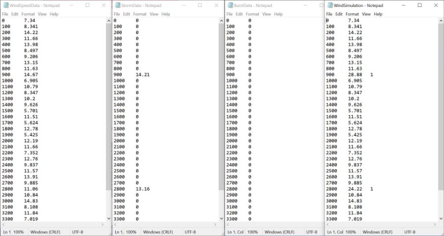
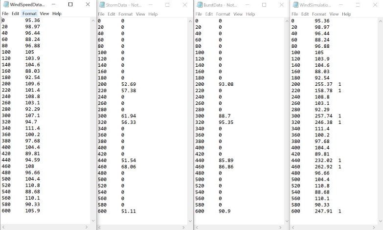
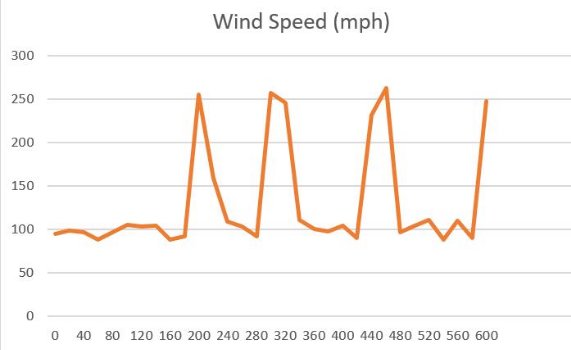

**Step 1: Problem Identification and Statement** 

*The objective is to develop a software that can generate a computer simulation of wind speed for a flight simulator. The final wind simulation is generated by modelling wind speed and incorporating storm simulation and microbursts simulation to it.* 

**Step  2:  Gathering  of  Information  and  Input/Output Description**

**Relevant information:**  

*The wind speed for a particular region can be modelled by using an average value and a gust value that is added to the average. For example, the wind speed might be 10 miles per hour, with added noise (which represents gusts) of 5 miles per hour, the wind speed would be a value between 5 and 15 (10 ±5). Starting from time at 0 seconds up to the entire simulation duration, at every interval the software generates a corresponding random number between the (average value – gust value) and the (average value + gust value), in accordance with the simulation configuration.*   

*Assuming that the possibility of encountering a storm at each time step is Pstorm, the software adds a storm magnitude (a random number between the minimum and maximum storm amplitude values) to the simulated wind speed for a duration T (a random number between the minimum and maximum storm duration). All required values are taken from the simulation configuration.* 

*The storm simulation also includes a simulation of microbursts. Microburst are simulated using three parameters: the possibility of encountering a microburst at each time step in a storm (Pburs), the burst amplitude (a random number between the minimum and maximum microburst amplitude values), and the duration of the burst (a random number between the minimum and maximum storm duration values). All required values are taken from the simulation configuration.* 

**Input/Output Description:**  

*The inputs are: Simulation Configuration (“simulationConfiguration.txt") The outputs are:*  

1. *Wind Speed Data ("WindSpeedData.txt")* 
1. *Storm Simulation Data ("StormData.txt")* 
1. *Microbursts Simulation Data ("BurstData.txt")* 
1. *Wind Simulation Data ("WindSpeedData.txt")* 

*The Simulation Configuration file will include the following inputs required for the simulation:*  

1. Wind simulation configurations: *the average speed, gust value, duration, and step size* 
1. Storm simulation parameters: *the storm probability, the minimum and maximum storm amplitude, and the minimum and maximum storm duration values* 
1. Microburst parameters: *the microburst probability, the minimum and maximum burst amplitude, and the minimum and maximum microburst duration values* 

*The software assumes that all input values in the simulation configuration are valid values and fall within the scope of the problem.* 

*Output 4, the Wind Simulation Data is a combination of output 1, output 2 and output 3. All outputs will be in the format of text files, with the first column being the time and the second column the corresponding magnitude at that time. In the Wind Simulation Data text file, all active storm instances will have an additional third column of ‘1’ signifying the presence of the storm.*

**Black-box Diagram:**

Alternatively, the inputs and outputs could be represented using a black-box diagram: *Wind Speed Data *

*Storm Simulation Simulation Data* 

*Configuration*

*Microbursts Simulation Data* 

*Wind Simulation Data* 

**Step 3: Design of the Algorithm and hand-solved problems** 

**Test cases:**  

**Test case 1:** 

<table><tr><th colspan="1" rowspan="4"><b>Input</b> </th><th colspan="1">Average Wind Speed </th><th colspan="1">Gust Value </th><th colspan="1">Simulation Duration </th><th colspan="1">Step Size </th><th colspan="1">Storm Probability </th><th colspan="1">Minimum Storm Amplitude </th><th colspan="1">Maximum Storm Amplitude </th></tr>
<tr><td colspan="1">10 </td><td colspan="1">5 </td><td colspan="1">3600 </td><td colspan="1">100 </td><td colspan="1">0\.05 </td><td colspan="1">10 </td><td colspan="1">20 </td></tr>
<tr><td colspan="1">Minimum Storm Duration Value </td><td colspan="1">Maximum Storm Duration Value </td><td colspan="1">Microburst Probability </td><td colspan="1">Minimum Burst Amplitude </td><td colspan="1">Maximum Burst Amplitude </td><td colspan="1">Minimum Burst Duration Value </td><td colspan="1">Maximum Burst Duration Value </td></tr>
<tr><td colspan="1">80 </td><td colspan="1">110 </td><td colspan="1">0\.02 </td><td colspan="1">35 </td><td colspan="1">46 </td><td colspan="1">50 </td><td colspan="1">75 </td></tr>
</table>

**Expected Outcome:**  

Text files generated: WindSpeedData.txt, StormData.txt, BurstData.txt, WindSimulation.txt All text files will have 2 columns: time and the corresponding magnitude.  

Time column will start at 0 and have an increment of 100 seconds at each step till it reaches 3600. Hence, there will be 36 rows (data point coordinates) in total.  

All magnitudes generated by the software in WindSpeedData.txt will be between 5.0 and 15.0. 

In the case that a storm occurs (probability of 5%), the corresponding magnitude in StormData.txt will be between 10.0 and 20.0 and this will occur for a minimum of 80 seconds (1 step/row) and for a maximum of 110 seconds (2 steps/row). All other rows will have a magnitude of 0.0. Since the probability is low, most storm magnitudes will be 0.0. 

A burst shall only occur in the case of a storm, and even then its probability is only 2%. The magnitude in BurstData.txt will be between 35.0 and 46.0 for a minimum of 50 seconds (1 step/row) and a maximum of 75 seconds (1 step/row).  

The final WindSimulation.txt file will combine the corresponding magnitudes at each time step of all the other files. The WindSimulation.txt will have a third column displaying ‘1’ in case a storm occurs in that particular time step.  

**Test case 2:** 

<table><tr><th colspan="1" rowspan="4"><b>Input</b> </th><th colspan="1">Average Wind Speed </th><th colspan="1">Gust Value </th><th colspan="1">Simulation Duration </th><th colspan="1">Step Size </th><th colspan="1">Storm Probability </th><th colspan="1">Minimum Storm Amplitude </th><th colspan="1">Maximum Storm Amplitude </th></tr>
<tr><td colspan="1">100 </td><td colspan="1">12 </td><td colspan="1">600 </td><td colspan="1">20 </td><td colspan="1">0\.1 </td><td colspan="1">50 </td><td colspan="1">70 </td></tr>
<tr><td colspan="1">Minimum Storm Duration Value </td><td colspan="1">Maximum Storm Duration Value </td><td colspan="1">Microburst Probability </td><td colspan="1">Minimum Burst Amplitude </td><td colspan="1">Maximum Burst Amplitude </td><td colspan="1">Minimum Burst Duration Value </td><td colspan="1">Maximum Burst Duration Value </td></tr>
<tr><td colspan="1">12 </td><td colspan="1">28 </td><td colspan="1">0\.76 </td><td colspan="1">84 </td><td colspan="1">98 </td><td colspan="1">9 </td><td colspan="1">18 </td></tr>
</table>

**Expected Outcome:**  

Text files generated: WindSpeedData.txt, StormData.txt, BurstData.txt, WindSimulation.txt All text files will have 2 columns: time and the corresponding magnitude.  

Time column will start at 0 and have an increment of 20 seconds at each step till it reaches 600. Hence, there will be 30 rows (and data-points) in total.  

All magnitudes generated by the software in WindSpeedData.txt will be between 88.0 and 112.0. 

In the case that a storm occurs (10% probability, low), the magnitude in StormData.txt will be between 50.0 and 70.0 and this will occur for a minimum of 12 seconds (1 step/row) and for a maximum of 28 seconds (2 steps/row). All other rows will have a magnitude of 0.0. 

A burst shall only occur in the case of a storm. However, the probability of a burst occurrence is 76% (very high) and thus, most storm cases will have corresponding burst occurrence too. Thus, we can expect most storm cases to have corresponding burst occurrences. The magnitude in BurstData.txt will be between 84.0 and 98.0 for a minimum of 9 seconds (1 step/row) and a maximum of 18 seconds (1 step/row).  

The final WindSimulation.txt file will combine the corresponding magnitudes at each time step of all the other files. The WindSimulation.txt will have a third column displaying ‘1’ in case a storm occurs in that particular time step.  

Assignment 5 | Mechanical Engineering Case Study | Saakshi More   5
**Test case 3:** 
<table><tr><th colspan="1" rowspan="4"><b>Input</b> </th><th colspan="1">Average Wind Speed </th><th colspan="1">Gust Value </th><th colspan="1">Simulation Duration </th><th colspan="1">Step Size </th><th colspan="1">Storm Probability </th><th colspan="1">Minimum Storm Amplitude </th><th colspan="1">Maximum Storm Amplitude </th></tr>
<tr><td colspan="1">567 </td><td colspan="1">67 </td><td colspan="1">145 </td><td colspan="1">5 </td><td colspan="1">0\.5 </td><td colspan="1">150 </td><td colspan="1">205 </td></tr>
<tr><td colspan="1">Minimum Storm Duration Value </td><td colspan="1">Maximum Storm Duration Value </td><td colspan="1">Microburst Probability </td><td colspan="1">Minimum Burst Amplitude </td><td colspan="1">Maximum Burst Amplitude </td><td colspan="1">Minimum Burst Duration Value </td><td colspan="1">Maximum Burst Duration Value </td></tr>
<tr><td colspan="1">2 </td><td colspan="1">12 </td><td colspan="1">0\.08 </td><td colspan="1">300 </td><td colspan="1">400 </td><td colspan="1">3 </td><td colspan="1">8 </td></tr>
</table>

**Expected Outcome:**  

Text files generated: WindSpeedData.txt, StormData.txt, BurstData.txt, WindSimulation.txt All text files will have 2 columns: time and the corresponding magnitude.  

Time column will start at 0 and have an increment of 5 seconds at each step till it reaches 145. Hence, there will be 29 rows (and data-points) in total.  

All magnitudes generated by the software in WindSpeedData.txt will be between 500.0 and 634.0. 

In the case that a storm occurs (50% probability), the magnitude in StormData.txt will be between 150.0 and 205.0 and this will occur for a minimum of 2 seconds (1 step/row) and for a maximum of 12 seconds (3 steps/row). In this test case, the probability of a storm occurrence is very high, hence most storm magnitudes will be non-zero values. All other rows will have a magnitude of 0.0. 

A burst shall only occur in the case of a storm. However, the probability of a burst occurrence is 8% (low) and thus, not many storm cases will have corresponding burst occurrence. The magnitude in BurstData.txt will be between 300.0 and 400.0 for a minimum of 3 seconds (1 step/row) and a maximum of 8 seconds (2 steps/row).  

The final WindSimulation.txt file will combine the corresponding magnitudes at each time step of all the other files. The WindSimulation.txt will have a third column displaying ‘1’ in case a storm occurs in that particular time step.  

Assignment 6 | Mechanical Engineering Case Study | Saakshi More   6
**Test case 4:** 
<table><tr><th colspan="1" rowspan="4"><b>Input</b> </th><th colspan="1">Average Wind Speed </th><th colspan="1">Gust Value </th><th colspan="1">Simulation Duration </th><th colspan="1">Step Size </th><th colspan="1">Storm Probability </th><th colspan="1">Minimum Storm Amplitude </th><th colspan="1">Maximum Storm Amplitude </th></tr>
<tr><td colspan="1">40 </td><td colspan="1">3 </td><td colspan="1">800 </td><td colspan="1">32 </td><td colspan="1">0\.09 </td><td colspan="1">100 </td><td colspan="1">120 </td></tr>
<tr><td colspan="1">Minimum Storm Duration Value </td><td colspan="1">Maximum Storm Duration Value </td><td colspan="1">Microburst Probability </td><td colspan="1">Minimum Burst Amplitude </td><td colspan="1">Maximum Burst Amplitude </td><td colspan="1">Minimum Burst Duration Value </td><td colspan="1">Maximum Burst Duration Value </td></tr>
<tr><td colspan="1">10 </td><td colspan="1">30 </td><td colspan="1">0\.23 </td><td colspan="1">200 </td><td colspan="1">250 </td><td colspan="1">1 </td><td colspan="1">14 </td></tr>
</table>

**Expected Outcome:**  

Text files generated: WindSpeedData.txt, StormData.txt, BurstData.txt, WindSimulation.txt All text files will have 2 columns: time and the corresponding magnitude.  

Time column will start at 0 and have an increment of 32 seconds at each step till it reaches 800. Hence, there will be 25 rows (and data-points) in total.  

All magnitudes generated by the software in WindSpeedData.txt will be between 37.0 and 43.0. 

In the case that a storm occurs (9% probability), the magnitude in StormData.txt will be between 100.0 and 120.0 and this will occur for a minimum of 10 seconds (1 step/row) and for a maximum of 30 seconds (1 step/row). In this test case, the probability of a storm occurrence is low, hence most storm magnitudes will be zero values.  

A burst shall only occur in the case of a storm. However, the probability of a burst occurrence is 23% (moderate) and thus, some storm cases will have corresponding burst occurrence. The magnitude in BurstData.txt will be between 200.0 and 250.0 for a minimum of 1 seconds (1 step/row) and a maximum of 14 seconds (1 step/row).  

The final WindSimulation.txt file will combine the corresponding magnitudes at each time step of all the other files. The WindSimulation.txt will have a third column displaying ‘1’ in case a storm occurs in that particular time step.  

Assignment 7 | Mechanical Engineering Case Study | Saakshi More   7

**Algorithm design:*** 

*Main() Function* 

*Initialize wsize as constant integer of value 4* 

*Initialize ssize as constant integer of value 5*

*Initialize bsize as constant integer of value 5* 

*Declare winddata as double array of size wsize*

*Declare stormdata as double array of size ssize*

*Declare burstdata as double array of size bsize*

*Call function loadconfiguration(winddata, stormdata, burstdata)* 

*Call function generatewindspeeddata(winddata, wsize)* 

*Call function generatestormdata(winddata, stormdata, wsize, ssize)* 

*Call function generateburstdata(winddata, stormdata, burstdata, wsize, ssize, bsize) Call function generatewindsimulation()* 

*End Program* 

*loadconfiguration() Function accepts double winddata[], double stormdata[], double burstdata[]* 

*Create input file stream myfile* 

*Open “simulationConfiguration.txt” in input mode through myfile* 

*If opening fails* 

*Print error message “Unsuccessful in loading configuration”, newline* 

*Exit program* 

*Assign 0 to integer variable i and loop till less i is than 4* 

*Read myfile value into winddata at index i* 

*Increment i by 1* 

*Assign 0 to integer variable i and loop till less i is than 5* 

*Read myfile value into stormdata at index i* 

*Increment i by 1* 

*Assign 0 to integer variable i and loop till less i is than 5* 

*Read myfile value into burstdata at index i* 

*Increment i by 1* 

*Close myfile* 

*generatewindspeeddata() Function accepts double winddata[], int wsize* 

*Create output file stream myfile* 

*Open “WindSpeedData.txt” in output mode through myfile* 

*If opening fails* 

*Print error message “Unsuccessful in loading configuration”, newline* 

*Exit program* 

*Initialise max as double and assign sum of winddata at index 0 and winddata at index 1 to max* 

*Initialise min as double and assign difference of winddata at index 0 and winddata at index 1 to min* 

*Set the seed of random function to time(0)* 

*Assign 0 to integer variable t and loop till t is less than or equal to winddata at index 2* 

*Output to myfile t, tab space*  

*Output to myfile, set precision to 4, call function frand(max, min), newline Increment t by winddata at index 3* 

*Close myfile* 

Assignment 8 | Mechanical Engineering Case Study | Saakshi More   8

*generatestormdata() Function accepts double winddata[],double stormdata[], int wsize, int ssize* 

*Create output file stream myfile* 

*Open “StormData.txt” in output mode through myfile* 

*If opening fails* 

*Print error message “Unsuccessful in loading configuration”, newline* 

*Exit program* 

*Set the seed of random function to time(0)* 

*Assign 0 to integer variable t and loop till t is less than or equal to winddata at index 2* 

*Initialise pstorm as double that calls function frand(0.0, 1.0)*  

*If pstorm is less than or equal to stormdata at index 0* 

*Initialise i as integer variable of value t*  

*Initialize stormdmin as integer of value stormdata at index 3*  

*Initialize stormdmax as integer of value stormdata at index 4* 

*Declare stormd as integer* 

*Generate a pseudorandom integer between stormdmin and stormdmax  Assign the sum of t and the pseudorandom integer to stormd* 

*Start loop with i till i is less than or equal to winddata at index 2 and i is less than or equal to stormd* 

*Declare stormmag as double that calls function frand(stormdata at index 1, stormdata at index 2)*  

*Output to myfile i, tab space, set precision to 4, stormmag, newline Assign i to t* 

*Increment i by winddata at 3* 

*Otherwise* 

*Output to myfile t, tab space, “0”, newline* 

*Increment t by winddata at index 3* 

*Close myfile* 

*generateburstdata() Function accepts double winddata[],double stormdata[], double burstdata[], int wsize, int ssize, int bzise* 

*Create input file stream sfile* 

*Open “StormData.txt” in input mode through sfile* 

*If opening fails* 

*Print error message “Unsuccessful in loading configuration”, newline* 

*Exit program* 

*Create output file stream myfile* 

*Open “BurstData.txt” in output mode through myfile* 

*If opening fails* 

*Print error message “Unsuccessful in loading configuration”, newline* 

*Exit program* 

*Set the seed of random function to time(0)* 

*Assign 0 to integer variable time* 

*Assign 0 to integer variable t and start loop till t is less than or equal to winddata at index 2* 

*Read value from sfile into time* 

*Declare stormmag as double* 

*Read value from sfile into stormmag* 

*If stormmag is not equal to 0.0* 

*Declare bstorm as double that calls function frand(0.0, 1.0)* 

*if bstorm is less than or equal to burstdata at index 0* 

*Initialise i as integer of value t*  

*Initialize burstdmin as integer with burstdata at index 3*  

*Initialize burstdmax as integer with burstdata at index 4*  

*Declare burstd as integer* 

*Generate  a  pseudorandom  integer  between  burstdmin  and burstdmax*  

*Assign the sum of t and the pseudorandom integer to burstd* 

*Start loop with i till i is less than or equal to winddata at index 2 and i is less than or equal to burstd* 

*Initialize  burstmag  as  double  the  calls  function frand(burstdata at index 1, burstdata at index 2)*  

*Output to myfile i, tab space, set precision to 4, burstmag, newline* 

*Assign i to t* 

*Increment i by winddata at 3* 

*Otherwise* 

*Output to myfile t, tab space, “0”, newline* 

*Otherwise* 

*Output to myfile t, tab space, “0”, newline  Increment t by winddata at index 3* 

*Close myfile Close sfile* 

*generatewindsimulation() function* 

*Create input file stream wfile* 

*Open “WindSpeedData.txt” in input mode through wfile* 

*If opening fails* 

*Print error message “Unsuccessful in loading configuration”, newline Exit program*  

*Create input file stream sfile* 

*Open “StormData.txt” in input mode through sfile* 

*If opening fails* 

*Print error message “Unsuccessful in loading configuration”, newline Exit program* 

*Create input file stream bfile* 

*Open “BurstData.txt” in input mode through bfile* 

*If opening fails* 

*Print error message “Unsuccessful in loading configuration”, newline Exit program* 

*Create output file stream wsfile* 

*Open “WindSimulation.txt” in output mode through wsfile* 

*If opening fails* 

*Print error message “Unsuccessful in loading configuration”, newline Exit program* 

*Declare t as integer* 

*Read value from wfile into t* 

*Read value from sfile into t* 

*Read value from bfile into t* 

*Repeat while wfile is good and sfile is good and bfile is good* 

*Output to wsfile t, tab space* 

*Declare wspeed, stormmag, burstmag as double* 

*Read value from wfile into wspeed* 

*Read value from sfile into stormmag* 

*Read value from bfile into burstmag* 

*Initialize wsmag as double with the sum of wspeed, stormmag and burstmag  Output to wsfile wsmag* 

*If stormmag is not equal to 0.0*  

*Output to wsfile tab space, “1”* 

*Output to wsfile newline* 

*Read value from wfile into t* 

*Read value from sfile into t* 

*Read value from bfile into t* 

*Close wfile Close sfile Close bfile Close wsfile* 

*frand() function accepts (double max, double min)* 

*Return a pseudorandom floating point between min and max* 

**Step 4: Implementation**

//\*\*\*\*\*\*\*\*\*\*\*\*\*\*\*\*\*\*\*\*\*\*\*\*\*\*\*\*\*\*\*\*\*\*\*\*\*\*\*\*\*\*\*\*\*\*\*\*\*\*\*\*\*\*\*\*\*\*\*// //\*\* Author: Saakshi More \*\*// 

//\*\* University ID: N13275625 \*\*// 

//\*\* Date Created: October 20, 2021 \*\*// 

//\*\* Assignment 2: Flight Simulator Wind Speed \*\*// 

//\*\* UH-1000 Computer Programming for Engineers, NYUAD \*\*// //\*\* Problem: \*\*// 

//\*\* Wind Simulation given the simulation configuration \*\*// //\*\*\*\*\*\*\*\*\*\*\*\*\*\*\*\*\*\*\*\*\*\*\*\*\*\*\*\*\*\*\*\*\*\*\*\*\*\*\*\*\*\*\*\*\*\*\*\*\*\*\*\*\*\*\*\*\*\*\*// 

#include <iostream> #include <fstream>  #include <string> #include <iomanip> #include <cstdlib> 

using namespace std; 

//function prototypes: 

void loadconfiguration(double winddata[], double stormdata[], double burstdata[]); void generatewindspeeddata(double winddata[], int wsize); 

void generatestormdata(double winddata[], double stormdata[], int wsize, int ssize); void generateburstdata(double winddata[], double stormdata[], double burstdata[], int wsize, int ssize, int bsize); 

void generatewindsimulation(); 

double frand(double max, double min); 

int main() 

{ 

const int wsize = 4;//wind speed configuration data array size 

const int ssize = 5;//storm configuration data array size 

const int bsize = 5;//microbursts configuration data array size 

double winddata[wsize]; //wind speed configuration data array  

double stormdata[ssize];//storm configuration data array  

double burstdata[bsize];//microbursts configuration data array loadconfiguration(winddata, stormdata, burstdata);//function to read configuration from the simulation configuration file into the relevant arrays generatewindspeeddata(winddata, wsize);//function to create a file of time and corresponding wind speed using the simulation configuration data generatestormdata(winddata, stormdata, wsize, ssize);//function to create a file of time and corresponding storm magnitude using the simulation configuration data 

generateburstdata(winddata, stormdata, burstdata, wsize, ssize, bsize);//function to create a file of time and corresponding microburst magnitude using the simulation configuration data generatewindsimulation();//function to create a file that aggregates the windspeed, storm and microburts data  

return 0; } 

void loadconfiguration(double winddata[], double stormdata[], double burstdata[]) 

{ 

ifstream myfile;//opening an input file stream myfile.open("simulationConfiguration.txt");//opening a pre-existing file named "simulationConfiguration.txt" 

if (myfile.fail())//file cannot be opened 

{ 

cerr << "Unsuccessful in loading configurations" << endl; 

exit(-1); 

} 

//This software assumes that all values in the simulation configuration file are valid and logical 

for (int i = 0;i < 4;i++)//the first 4 values on the configuration file are wind speed data 

myfile >> winddata[i];//reading value into the wind speed data array 

for (int i = 0;i < 5;i++)//the next 5 values are storm data 

myfile >> stormdata[i];//reading value into the storm data array 

for (int i = 0;i < 5;i++)//the last 5 values are burst data 

myfile >> burstdata[i];//reading value into the burst data array 

myfile.close(); 

} 

void generatewindspeeddata(double winddata[], int wsize) 

{ 

ofstream myfile;//opening an output file stream myfile.open("WindSpeedData.txt"); 

if (myfile.fail()) 

{ 

cerr << "Unsuccessful in creating file"; 

exit(-1); 

} 

double max = winddata[0] + winddata[1];//maximum wind speed = average + gust value 

double min = winddata[0] - winddata[1];//minimum wind speed = average - gust value 

srand(time(0));//setting a seed to ensure that different set of random integers are created by the following rand() function each time the program runs 

for (int t = 0;t <= winddata[2];t += winddata[3])//loop to start from time at 0 seconds upto the given simulation duration, incrementing using the given step size 

{ 

myfile << t << "\t"; 

myfile << setprecision(4) << frand(max,min) << endl;//generating random floating point numbers between the minimum and maximum wind speed values of 4 significant digits 

} 

myfile.close(); 

} 

void generatestormdata(double winddata[], double stormdata[], int wsize, int ssize) { 

ofstream myfile; 

myfile.open("StormData.txt"); 

if (myfile.fail()) 

{ 

cerr << "Unsuccessful in creating file"; 

exit(-1); 

} 

srand(time(0)); 

int t = 0; 

for(int t=0; t<=winddata[2];t+=winddata[3]) 

{ 

double pstorm = (frand(0.0, 1.0));//probability of storm occurrence if (pstorm <= stormdata[0]) 

{ 

int i = t; 

int stormdmin = stormdata[3];//minimum storm amplitude 

int stormdmax = stormdata[4];//maximum storm amplitude 

int stormd = t+ ((rand() % (stormdmax-stormdmin + 1)) + stormdmin);//storm duration  

for (i=t;i<=winddata[2]&&i<=stormd;i+=winddata[3]) 

{ 

double stormmag = frand(stormdata[1], stormdata[2]);//random floating point number between the minimum and maximum storm amplitude 

myfile << i <<"\t" << setprecision(4) << stormmag << endl; t = i;//to ensure that the outer loop continues without repeating the inner loop values 

} } 

else 

{ 

myfile << t << "\t0" << endl;//storm magnitude will be 0 in case the probability condition isn't fulfilled 

} 

} myfile.close(); 

} 

void generateburstdata(double winddata[], double stormdata[], double burstdata[], int wsize, int ssize, int bsize) 

{ 

ifstream sfile; 

sfile.open("StormData.txt");//create an input file stream of the StormData.txt if (sfile.fail()) 

{ 

cerr << "Unsuccessful in creating file"; 

exit(-1); 

} 

ofstream myfile; 

myfile.open("BurstData.txt"); 

if (myfile.fail()) 

{ 

cerr << "Unsuccessful in creating file"; 

exit(-1); 

} 

srand(time(0)); 

int time = 0; 

for (int t = 0; t <= winddata[2];t += winddata[3]) 

{ 

sfile >> time; 

double stormmag; 

sfile >> stormmag; 

if (stormmag != 0.0)//burst occurs only in the event that a storm is taking place 

{ 

double bstorm = (frand(0.0, 1.0)); 

if (bstorm <= burstdata[0]) 

{ 

int i = t; 

int burstdmin = burstdata[3];//minimum burst amplitude int burstdmax = burstdata[4];//maximum burst amplitude int burstd = t + ((rand() % (burstdmax - burstdmin + 1)) + burstdmin);//burst duration 

for (i = t;i <= winddata[2] && i <=burstd;i +=winddata[3]) { 

double burstmag = frand(burstdata[1],burstdata[2]); myfile << i << "\t" << setprecision(4) << burstmag <<endl; 

t = i; 

} } 

else 

{ 

myfile << t << "\t0" << endl;//the burst does not occur in case the probability case isn't fulfilled 

} 

} else { 

myfile << t << "\t0" << endl;//the burst does not occur in case there is no storm at all 

} 

} myfile.close(); sfile.close(); 

} 

void generatewindsimulation() 

{ 

ifstream wfile; 

wfile.open("WindSpeedData.txt"); 

if (wfile.fail()) 

{ 

cerr << "Unsuccessful in creating file"; 

exit(-1); 

} 

ifstream sfile; 

sfile.open("StormData.txt"); 

if (sfile.fail()) 

{ 

cerr << "Unsuccessful in creating file"; 

exit(-1); 

} 

ifstream bfile; 

bfile.open("BurstData.txt"); 

if (bfile.fail()) 

{ 

cerr << "Unsuccessful in creating file"; 

exit(-1); 

} 

ofstream wsfile; 

wsfile.open("WindSimulation.txt");//creating an output file stream for the final wind simulation data 

if (wsfile.fail()) 

{ 

cerr << "Unsuccessful in creating file"; 

exit(-1); 

} 

int t; 

wfile >> t; 

sfile >> t; 

bfile >> t; 

//to move the pointer and ensure that the last line is not duplicated in the WindSimulation file 

while (wfile.good() && sfile.good() && bfile.good())//while all the three input file streams exist 

{ 

wsfile << t << "\t";//reading the time value into the wind simulation file 

double wspeed, stormmag, burstmag; 

wfile >> wspeed; 

sfile >> stormmag; 

bfile >> burstmag; 

double wsmag = wspeed + stormmag + burstmag;//adding the wind  speed, storm and burst magnitudes to create the final wind simulation magnitude wsfile << wsmag; 

if (stormmag != 0) 

wsfile << "\t1";//binary value to signify that a storm is active at this stage of the simulation 

wsfile << endl; 

//Moving to the next line of values: 

wfile >> t; 

sfile >> t; 

bfile >> t; 

} 

wfile.close(); 

sfile.close(); 

bfile.close(); 

wsfile.close(); 

} 

double frand(double max, double min)//function to generate a floating point number between two floating point numbers 

{ 

return (min + (double)(rand()) / (double)(RAND\_MAX / (max - min))); //Reference: https://www.delftstack.com/howto/cpp/how-to-generate-random- doubles-cpp/ 

} 

Assignment 16 | Mechanical Engineering Case Study | Saakshi More   16
**Test Case 2:** 

**Step 5: Software testing and Verification** 

**Test Case 1:  **

which is in agreement with the test case expected output.

Assignment 19 | Mechanical Engineering Case Study | Saakshi More   19
**Test Case 3:**  

which is in agreement with the test case expected output.

Assignment 20 | Mechanical Engineering Case Study | Saakshi More   20
**Test Case 4:**  

Which is in agreement with the test case expected output.

Assignment 21 | Mechanical Engineering Case Study | Saakshi More   21

*We conclude that the program is functioning correctly since all test cases are verified.* 

**User Guide:** 

- To execute the program, create a text file named “simulationConfiguration.txt” in the following format and save it in the same folder as your .cpp file: 

  

- Compile and run the code found in the file named flightsimulator.cpp  
- The wind simulation data can be found in the text file named “WindSimulation.txt” in the same folder 

**Reference:** 

DelfStack. (2021, March 30). *Generate Random Double in C++*. Retrieved from DelfStack: https://www.delftstack.com/howto/cpp/how-to-generate-random-doubles-cpp/
Assignment 2 | Mechanical Engineering Case Study | Saakshi More   22
